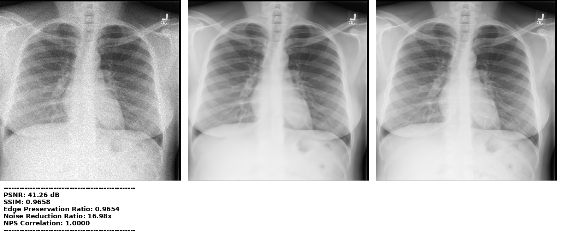

# **Chest X-Ray Denoising Project**

Welcome to the **Chest X-Ray Denoising Project** repository! This is a hands-on resource for researchers, developers, and enthusiasts who are interested in exploring techniques to improve the quality of noisy chest X-ray images. By leveraging state-of-the-art image denoising methods, you can make diagnostic processes more reliable and effective.

---

## **Overview**

This repository provides:

- A **noise generation function** (simulating 90% dose reduction) to create noisy chest X-ray images.
- Functions to calculate key **evaluation metrics** to measure the effectiveness of your denoising techniques.
- Example output showcasing how our denoising pipeline performs with the provided noisy samples.

### **The Goal**
Take the sample images, add noise using the provided function, apply your denoising algorithm, and evaluate the results using the included metrics. Compare your output against the original clean image to measure performance.
I am including my best results on this repo as well under the Denoised Samples directory here:( [Denoised Samples](https://github.com/VoteLadder/denoise/tree/main/Denoised%20Samples/))
These are the images generated by my best current model for reference along with their metrics. If the code snippet is used with another denoiser, it will add similar noise and smiliar metrics for new program.
The you can compare your model's result with the samples used in this directory:( [CXR samples](https://github.com/VoteLadder/denoise/tree/main/CXR%20samples/)). The model was NOT trained on these images.

Chest X-ray data can be obtained from Stanford's CheXpert databse:( [CheXpert:Chest X-rays](https://aimi.stanford.edu/datasets/chexpert-chest-x-rays)). The samples above were taken from the second batch that was not used for training of my current model.

---

## **Features**

- 🌟 **Simulate Noisy Images**: Use our `create_noise` function to replicate real-world scenarios of dose-reduced X-rays (90% reduction).
- 📏 **Evaluate Your Results**: Included metrics like **PSNR** (Peak Signal-to-Noise Ratio) and **SSIM** (Structural Similarity Index) help you quantify the quality of your denoised images.
- 📷 **Sample Outputs**: See what denoising looks like in action with our included output examples.
- 🚀 **Get Started Quickly**: Preloaded data and simple-to-follow scripts make it easy to dive in and test your own denoising algorithms.
# **Sample output, more in the main directory, use Jupyter Notebook template to emulate**

